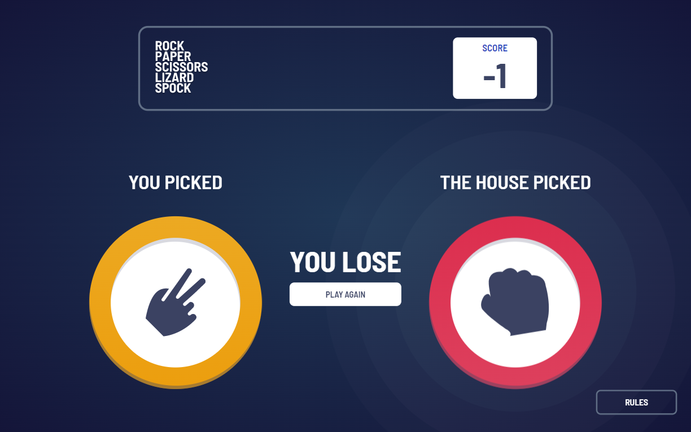

# Frontend Mentor - Rock Paper Scissors

This is a solution repository to the [Rock, Paper, Scissors Game on Frontend Mentor](https://www.frontendmentor.io/challenges/rock-paper-scissors-game-pTgwgvgH/hub/rock-paper-scissors-game-BU7E2KPCOo).

## Overview

### How to View the Project

To run the project, you can run the script

### `npm start`

Will run the app in the development mode.
Open [http://localhost:3000](http://localhost:3000) to view it in your browser.

The page will auto-reload whenever you make changes or when you save.

### The Challenge

Users should be able to:

- View the optimal layout for the game depending on their device's screen size
- Play Rock, Paper, Scissors against the computer
- Maintain the state of the score after refreshing the browser _(optional)_
- **Bonus**: Play Rock, Paper, Scissors, Lizard, Spock against the computer _(optional)_

### Screenshot

### Links

- Solution URL: [Github Repository](https://github.com/Adrian-py/RockPaperScissors)
- Live Site URL: [Live Site](https://adrian-py.github.io/RockPaperScissors/)

## My process

### Built with

- Semantic HTML5 markup
- CSS custom properties
- SASS/SCSS
- Flexbox
- [React](https://reactjs.org/) - JS library
- [Framer Motion] (https://www.framer.com/motion/) - React animation library

### What I Learned

Throughout the project, I have learned many valuable lessons and also learned new knowledge. Through tweaking the styling of the components, I discovered a new technique that makes the site responsive easier. Furthermore, I also learned React and Framer Motion, as this is my first actual Frontend Mentor project I do it with. There were many struggles trying to animate each component smoothly, but eventually through trial and error, I was able to create animations that I am comfortable with.

### Continued Development

In the future, I would love to continue using React and Framer Motion if possible and also try to use Bootstrap or Styled Components.
